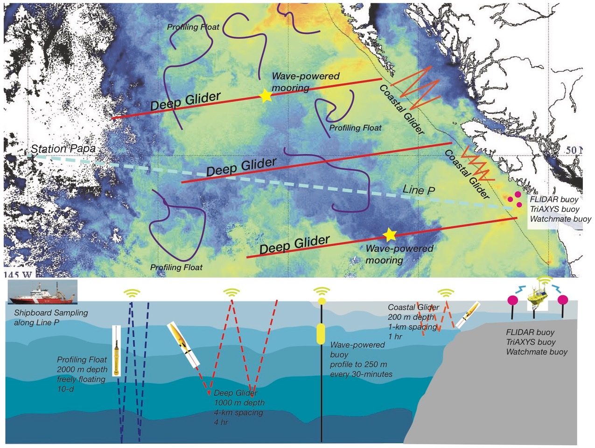

<body class="about" >

The Canadian Pacific Robotic Ocean Observing Facility uses state of the art technology to observe changes in the Northeast Pacific Ocean. The ocean and marine ecosystems are still poorly understood in many areas largely because of a lack of data. C-PROOF works to understand what drives ocean and climate variability, and our data is used to better predict weather and climate changes across Canada. Additionally, we collaborate with our partners to improve timely predictions of fish stocks so that economic and ecological concerns can be properly addressed. We also want to explore the ocean’s potential as a source of energy, which will help remote coastal communities and the country as a whole move towards carbon-free energy sources that rely on ocean waves and wind.
</body>

<figure>

<figcaption style="text-align:center;font-style: italic;font-size: 16px;">Diagram showing C-PROOF’s long-term vision for observing the Northeast Pacific Ocean, which includes a fleet of autonomous ocean gliders, profiling floats, wave-powered moorings, and buoys in coastal waters.</figcaption>
</figure>

<body>
<h3>What We Do</h3>

C-PROOF deploys <a href= '/platforms/'><strong>autonomous ocean gliders and floats</strong></a> to explore and monitor the ocean. These instruments are equipped with revolutionary new sensors capable of tracking life, measuring ocean nutrients, and quantifying ocean turbulence. We also plan to deploy mooring arrays with innovative instrumentation. Our data is publicly available and is shared with a wide array of partners and user groups for the benefit of Canadians; the data is used to inform ecosystem management, climate predictions, and weather forecasts. C-PROOF helps provide the information we need to make better plans for the future, and helps drive development of the technological solutions needed to enable those plans.

<a href ='/search/'><h3>In The News</h3></a>

 
<ul class="post-preview">   <!---post-preview  -->
    <a href="{{ post.url }}">
        <h4 class="post-title">  {{ post.title }}
        </h4>
    </a>

  </ul>




 
<h3>Publications</h3>

Wong Annie P. S., et al., 2020.<strong> Argo Data 1999–2019: Two Million Temperature-Salinity Profiles and Subsurface Velocity Observations From a Global Array of Profiling Floats</strong>, Frontiers in Marine Science, 7, <a href='https://www.frontiersin.org/article/10.3389/fmars.2020.00700'>doi:10.3389/fmars.2020.00700.</a>

Roemmich Dean, et al., 2019.<strong> On the Future of Argo: A Global, Full-Depth, Multi-Disciplinary Array</strong>, Frontiers in Marine Science, 6, <a href='https://www.frontiersin.org/article/10.3389/fmars.2019.00439/'>doi:10.3389/fmars.2019.00439.</a>

Testor Pierre, et al., 2019.<strong> OceanGliders: A Component of the Integrated GOOS</strong>, Frontiers in Marine Science, 6, <a href='https://www.frontiersin.org/article/10.3389/fmars.2019.00422/'>doi:10.3389/fmars.2019.00422.</a>

Barth John A., et al., 2019.<strong> Better Regional Ocean Observing Through Cross-National Cooperation: A Case Study From the Northeast Pacific</strong>, Frontiers in Marine Science, 6, <a href='https://www.frontiersin.org/article/10.3389/fmars.2019.00093/'>doi:10.3389/fmars.2019.00093. </a>

</body>

